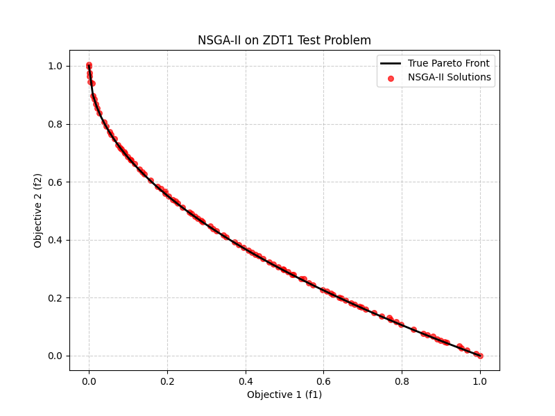

# 基于遗传算法的多目标优化问题求解：以 NSGA-II 求解 ZDT1 为例

## 1. 问题背景与动机

在实际的工程设计与资源分配中，我们经常面临多个相互冲突的优化目标。与单目标优化寻找绝对的“最优解”不同，多目标优化的核心在于寻找一组相互之间无法达成绝对超越的权衡解，即 **Pareto 前沿（Pareto Front）**。

本次实验选取多目标优化领域极具代表性的 **ZDT1 测试函数** 进行算法性能验证。其数学模型定义如下：

最小化目标函数：
$$f_1(x) = x_1$$
$$f_2(x) = g(x) \times \left(1 - \sqrt{\frac{f_1(x)}{g(x)}}\right)$$

其中，$g(x)$ 为惩罚函数：
$$g(x) = 1 + \frac{9}{n-1} \sum_{i=2}^n x_i$$

从数学角度直观地进行感知，我们不难发现，在 $n=30$ 且 $x_i \in [0, 1]$ 的搜索空间内，$f_1$ 试图压缩第一个变量，而 $f_2$ 受制于变量间的非线性耦合产生反弹。本质上，算法的任务就是在这种冲突中，寻找逼近理论最优边界 $f_2 = 1 - \sqrt{f_1}$ 的解集。

## 2. 核心算法与底层机制机制剖析

本次实验调用了 `pymoo` 框架中的核心求解器 **NSGA-II**（带精英策略的非支配排序遗传算法）。相较于传统遗传算法，NSGA-II 解决多目标冲突的底层处理机制极具针对性，主要包含两个核心算子：

### 2.1 快速非支配排序（Non-dominated Sorting）
算法将父代与交叉变异产生的子代混合，并基于“支配关系”将种群分层。和课上学到**支配**关系的定义一致，如果个体 A 在所有目标上都不劣于 B，且至少在一个目标上严格优于 B，则称 A 支配 B。在一开始，完全不被支配的解被划入 Rank 1，依次类推。这种机制确保了种群始终具备向绝对最优边界逼近的驱动力。

### 2.2 拥挤度距离（Crowding Distance）
和课上我们学到的思想一样，为了保持样本的均匀分布，当某一等级的解数量超过新一代种群的剩余容量时，算法会计算该层级内每个个体在目标空间中的“拥挤度”。
**这里设计很精妙**：它通过计算个体与相邻两个个体形成的矩形周长，来评估其周围的拥挤情况。在优胜劣汰时，算法会优先保留处于“空旷地带”的个体，直接从底层机制上防止了解的局部扎堆，保证了最终解集在 Pareto 前沿上的均匀分布。

其数据流转的底层抽象如下：

```text
[父代种群 N] ──交叉/变异──> [子代种群 N]
      │                         │
      └─────── 合并 (2N) ───────┘
                 ↓
      [机制 1: 快速非支配排序 (按优劣分层)]
      Rank 1 (最强):  → 优先进入新一代
      Rank 2 (次强):  → 填补新一代空缺
      Rank 3 (临界):  → 触发拥挤度筛选
                 ↓
      [机制 2: 拥挤度计算 (在 Rank 3 内部筛选)]
      个体 A (周围密集) → 淘汰
      个体 B (周围空旷) → 保留
                 ↓
          [新一代种群 N]
```

## 3. 实验设置与运行结果

### 3.1 参数配置
* **优化算法**：NSGA-II
* **种群大小 (Population Size)**：100
* **最大迭代代数 (Generations)**：200
* **随机种子 (Seed)**：1 （保证实验可复现）

### 3.2 结果可视化分析

实验运行的最终结果如下图所示：

> ****
> *图 1：NSGA-II 算法在 ZDT1 测试集上的求解结果*

如图 1 所示，黑色实线为 ZDT1 问题的真实 Pareto 前沿，红色散点为 NSGA-II 经过 200 代进化后输出的 100 个非支配解。可以直观观察到：
1.  **收敛性**：红色散点已经完全贴合黑色实线，未出现偏离前沿的劣质解。
2.  **多样性**：解集从 $f_1 \in [0, 1]$ 区间内均匀散布，像水滴一样附着在曲线上，没有在某一局部发生种群停滞或聚集。

### 3.3 量化指标评估

为了客观评估算法性能，实验引入了 **IGD (Inverted Generational Distance, 反向世代距离)** 指标。该指标通过计算真实 Pareto 前沿上的点到算法求得的非支配解集的最短距离的平均值，来同时衡量解的收敛性和分布均匀性。
IGD 的数学表达式如下：

$$IGD(P^*, P) = \frac{\sum_{v \in P^*} d(v, P)}{|P^*|}$$

其中：

$|P^*|$ 是真实前沿上参考点的总个数。

$v$ 是真实前沿 $P^*$ 上的某一个基准点。

$d(v, P)$ 表示从真实点 $v$ 出发，去寻找我们算法解集 $P$ 中离它最近的那个点，并计算它们之间的欧氏距离。其具体算式为：

$$d(v, P) = \min_{u \in P} \sqrt{\sum_{k=1}^m (v_k - u_k)^2}$$

（其中 $m$ 是优化目标的个数，在 ZDT1 中 $m=2$，$u$ 是我们算法求出的点）。


本次实验求得的 IGD 指标值为：**0.005002**。
这一极低的量级进一步从数据层面印证了算法求解的高质量，表明所求得的解集与理论绝对最优边界的误差已达到极小水平。

## 4. 总结

本次实验，我选择了高阶问题：用GA解决多目标优化问题。具体而言，我以多目标优化问题中经典的ZDT1作为损失函数，并用过NSGA-II算法进行求解，我用Python实现了算法，以IGD作为评价指标，并将求得结果与理论Pareto前沿进行了可视化对比。从结果上看，极低的 IGD 评价指标和（与理论Pareto前沿）高度重合的可视化结果，充分证明了该算法在权衡多目标冲突时的高效性与可靠性。

## 5. 源代码
```python
import matplotlib.pyplot as plt
from pymoo.problems import get_problem
from pymoo.algorithms.moo.nsga2 import NSGA2
from pymoo.optimize import minimize
from pymoo.indicators.igd import IGD

# 实例化 ZDT1 测试问题,其内部已封装好 30个变量、[0, 1]的边界限制以及 f1, f2 的计算逻辑
problem = get_problem("zdt1")

# pop_size=100 意味着每代有 100 个解在互相竞争和繁衍
algorithm = NSGA2(pop_size=100)

# ('n_gen', 200) 表示迭代 200 代，seed=1 锁定随机种子，保证每次运行结果一致
res = minimize(problem,
               algorithm,
               ('n_gen', 200),
               seed=1,
               verbose=False)

# res.F 是算法最终找到的 Pareto 前沿
our_front = res.F
# 调用 pymoo 内置的 pareto_front 方法获取 ZDT1 的真实理论前沿
true_front = problem.pareto_front()

# 5. 计算量化评价指标: IGD (反向世代距离)
# 用理论前沿去评估我们的解集，值越小越好
metric = IGD(true_front)
igd_value = metric.do(our_front)
print(f"求得的 IGD 指标值为: {igd_value:.6f}")

# 用 matplotlib 可视化库对实验结果进行可视化分析
plt.figure(figsize=(8, 6))
# 画理论前沿 (黑色实线)
plt.plot(true_front[:, 0], true_front[:, 1], color="black", linewidth=2, label="True Pareto Front")
# 画算法求出的解 (红色散点)
plt.scatter(our_front[:, 0], our_front[:, 1], color="red", s=30, alpha=0.7, label="NSGA-II Solutions")

plt.title("NSGA-II on ZDT1 Test Problem")
plt.xlabel("Objective 1 (f1)")
plt.ylabel("Objective 2 (f2)")
plt.legend()
plt.grid(True, linestyle='--', alpha=0.6)
plt.show()
```

